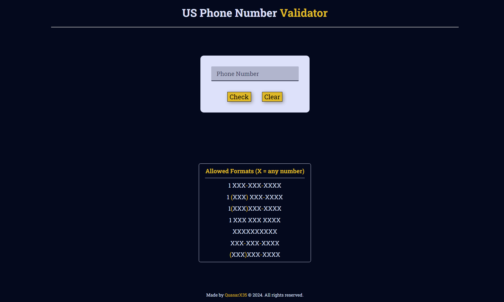
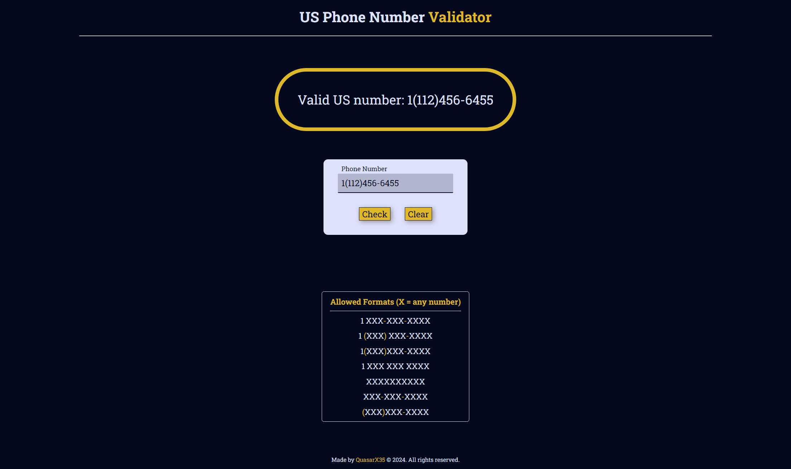
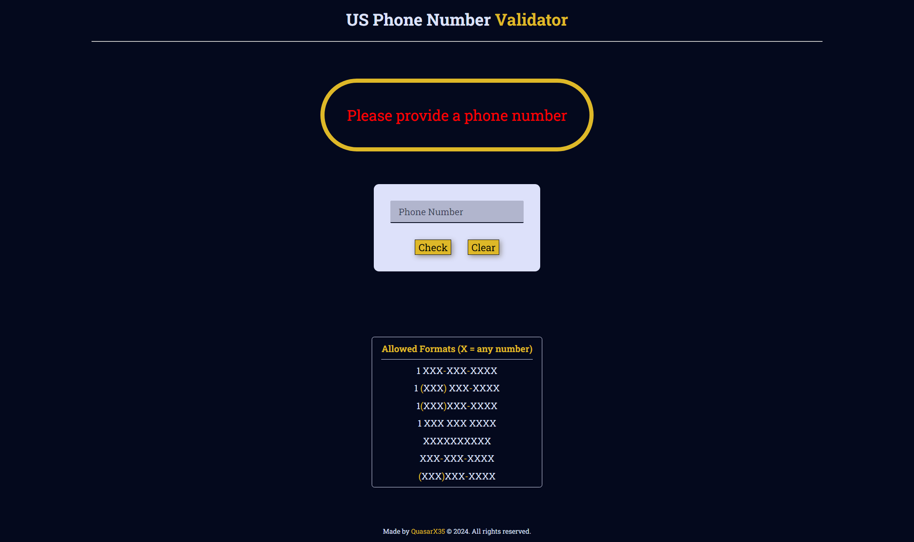
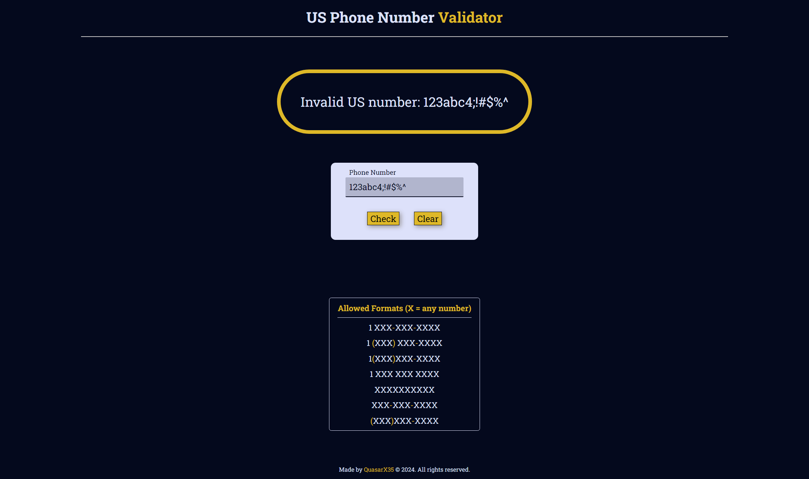

# US Phone Number Validator
This web application validates the format of a phone number against US phone number standards. It was created as a certification project for the FreeCodeCamp Javascript course. It can be accessed [here].

Important Note: This application only checks the format of the phone number and does not guarantee the number is actually callable or assigned.

## Using the Application
- Enter a phone number in the input field.
- Click the "Validate" button.
- The application will display a message indicating whether the format of the entered number is valid for a US phone number.
- A table at the bottom of the page shows all the valid formats of a US phone number that can be validated through the application.

## Functionality
- Accepts phone numbers in various formats (e.g., with or without hyphens, parentheses).
- Validates against standard US phone number patterns (including area codes and phone number lengths).
- Provides clear user feedback indicating if the input is a valid US phone number format.

## Technologies Used
- HTML: for structuring the user interface.
- CSS: for styling the layout and elements.
- JavaScript: for handling user interaction, validation logic, and formatting.

## Building the Application
- Clone this repository to your local machine.
- Open the index.html file in your web browser.
- Start editing any of the files.

## Screenshots

View the FreeCodeCamp challenge [here](https://www.freecodecamp.org/learn/javascript-algorithms-and-data-structures-v8/build-a-telephone-number-validator-project/build-a-telephone-number-validator).